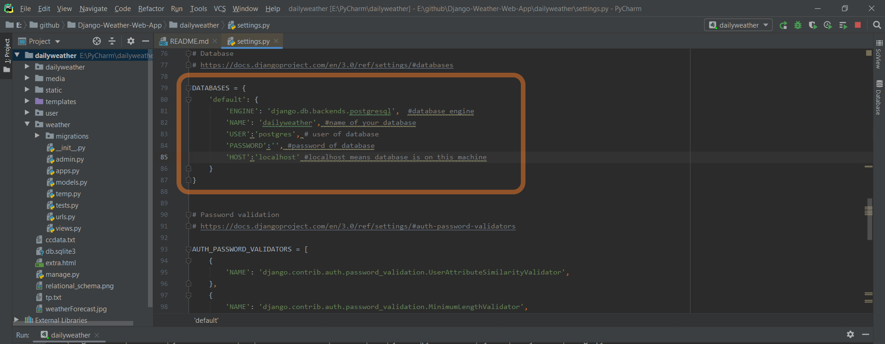

# Weather Web App
Forecast and weather website with DBMS

# Web Framework
**Python - Django**

# Inside The Project
Here ,I provide link of the video. In video, you will see view of the site and
brief explanation  about project and database. 

[Youtube Video](https://youtu.be/DiaSj8LzTtg)

In this repository, dailyweather is django environment. All media files(images 
which is part of databse like here images of cities) is in media folder and 
all statics files (css,js,image which is part of html) is in static folder.
Templates contain all html pages. User and Weather is app of dailyweather django 
environment. ccdata.txt conatins names of cities. ER diagram and relational schema
are ER-diagram and relational schema of Database.

when you complete you database setup and create table ,import weather_city.csv
in weather_city table and weather_country.csv in weather_country table. 
If you wish, you can also add more city in weather_city table. And also you can 
add image of a city in weather_city table and change image on site according to
city. 

## Changes In Code

Highlighted part in image, shows database setup. You should change according to your 
database. which is in dailyweather/settings.py

In every api call, provide your api key. 

